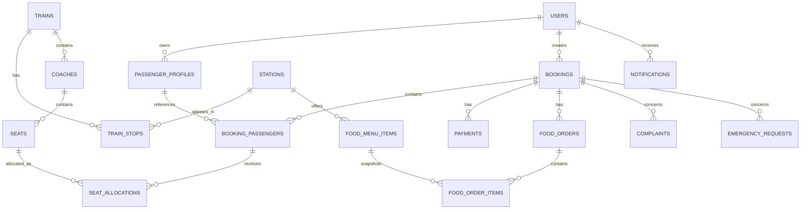

# SmartRail — ER Diagram (Mermaid)

```mermaid
erDiagram
    USERS ||--o{ PASSENGER_PROFILES : owns
    USERS ||--o{ BOOKINGS : creates
    USERS ||--o{ NOTIFICATIONS : receives

    TRAINS ||--o{ TRAIN_STOPS : has
    STATIONS ||--o{ TRAIN_STOPS : appears_in
    TRAINS ||--o{ COACHES : contains
    COACHES ||--o{ SEATS : contains

    BOOKINGS ||--o{ BOOKING_PASSENGERS : contains
    PASSENGER_PROFILES ||--o{ BOOKING_PASSENGERS : references
    BOOKING_PASSENGERS ||--o{ SEAT_ALLOCATIONS : receives
    SEATS ||--o{ SEAT_ALLOCATIONS : allocated_as

    BOOKINGS ||--o{ PAYMENTS : has
    BOOKINGS ||--o{ FOOD_ORDERS : has
    STATIONS ||--o{ FOOD_MENU_ITEMS : offers
    FOOD_MENU_ITEMS ||--o{ FOOD_ORDER_ITEMS : snapshots
    FOOD_ORDERS ||--o{ FOOD_ORDER_ITEMS : contains
    BOOKINGS ||--o{ COMPLAINTS : concerns
    BOOKINGS ||--o{ EMERGENCY_REQUESTS : concerns
```

This is the conceptual ER model. Physical PostgreSQL constraints and indexes should be finalized before migrations.
